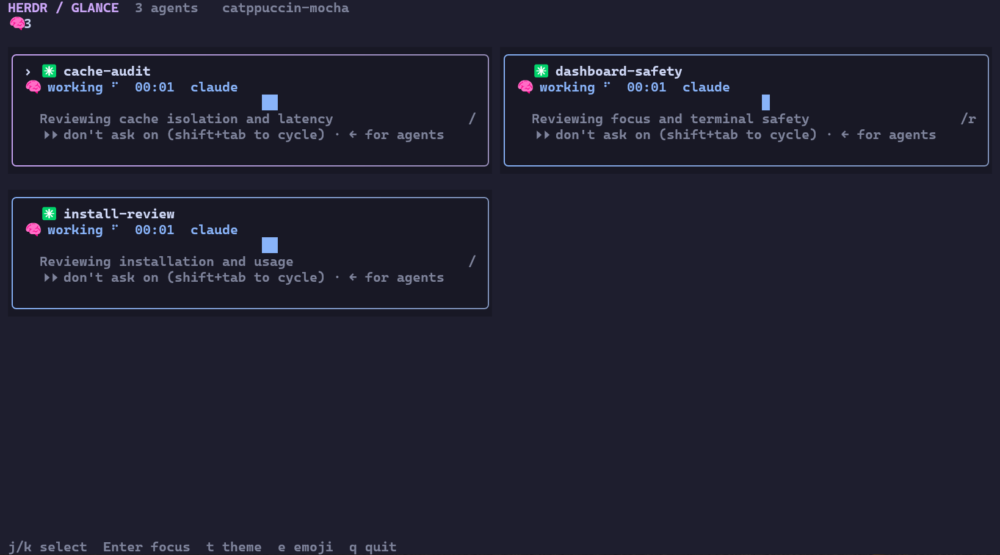
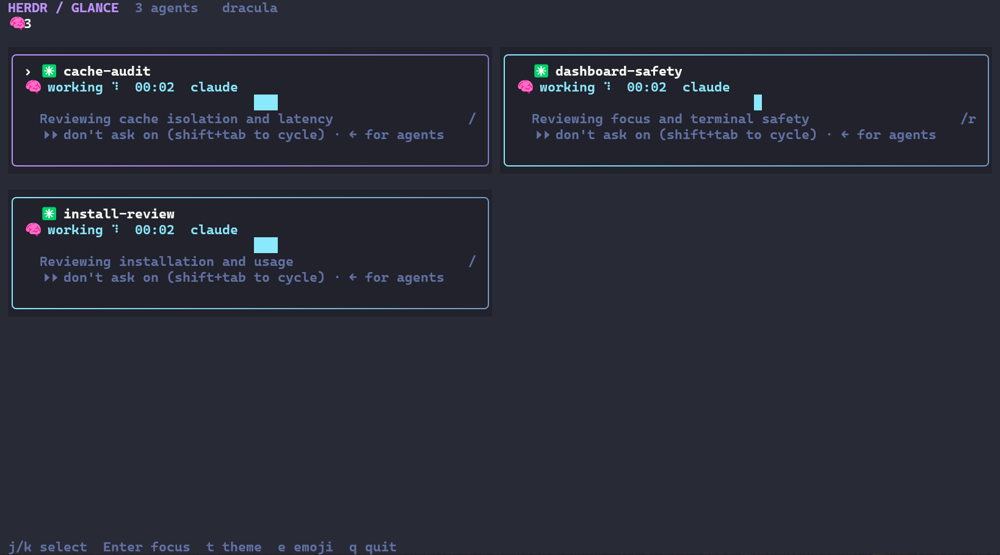
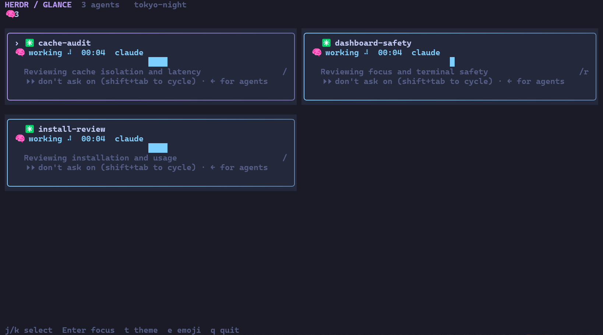
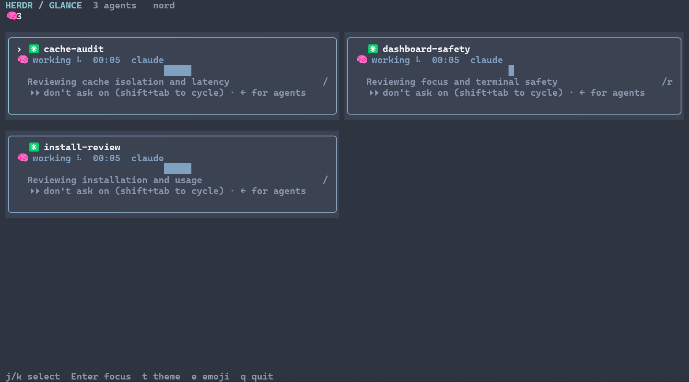
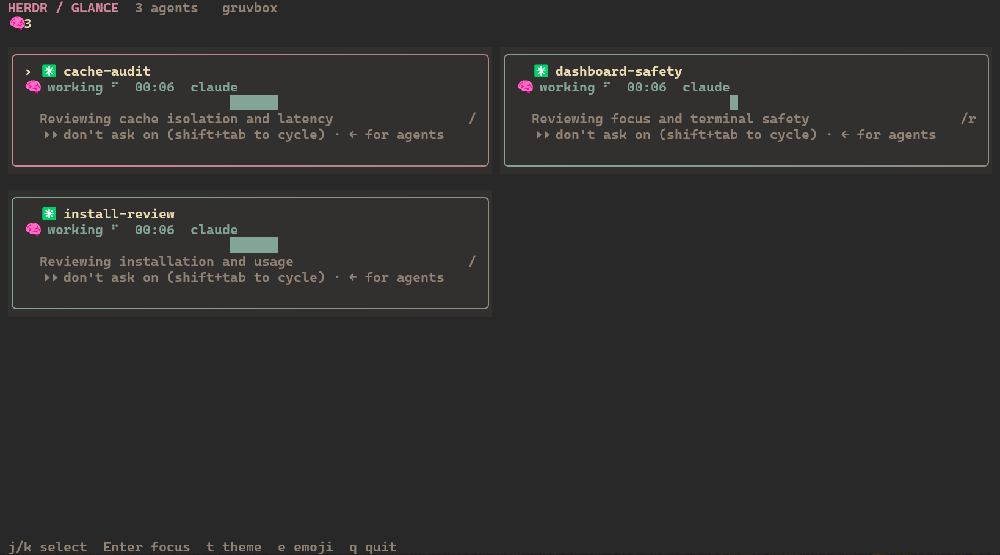

# herdr-glance

A live agent dashboard for Herdr. See who is working, who is waiting, and which agent needs your attention.



These are real terminal screenshots of three agents reviewing this project. Agent states come from Herdr; no statuses were fabricated. See [capture notes and task prompts](docs/screenshots/live/README.md). This is an independent companion to Herdr.

## Install

Requires Rust 1.88 or newer, Git, Herdr 0.8.2 or newer, and a real Herdr pane. Install through Herdr (builds from source with Cargo):

```sh
herdr plugin install ArtMoreno/herdr-glance
```

Open **Glance** from Herdr's plugin pane menu, or use the command for your platform:

```sh
# macOS / Linux
herdr plugin pane open --plugin herdr-glance --entrypoint dashboard
```

```powershell
# Windows
herdr plugin pane open --plugin herdr-glance --entrypoint dashboard-windows
```

The plugin opens a dedicated tab in the current workspace. Installation registers the plugin without starting Glance or changing your shell configuration. Remove it with `herdr plugin uninstall herdr-glance`.

For a `glance` command on PATH, install separately from source. The locked native dependencies declare Rust 1.88; local verification used Rust 1.97.1:

```sh
git clone https://github.com/ArtMoreno/herdr-glance.git
cd herdr-glance
cargo install --locked --path .
```

This installs `glance` into Cargo's bin directory, which must be on PATH. No crates.io package, binary release, or public Homebrew tap is published.

Local Homebrew installation on macOS/Linux:

```sh
export HERDR_GLANCE_SOURCE="$PWD"
cargo package --allow-dirty --no-verify
brew tap-new --no-git local/herdr-glance
cp Formula/herdr-glance.rb "$(brew --repository local/herdr-glance)/Formula/"
brew install --build-from-source local/herdr-glance/herdr-glance
brew test local/herdr-glance/herdr-glance
```

Skip `tap-new` if that local tap already exists. Keep `HERDR_GLANCE_SOURCE` set while using this development formula; it reads the local archive and computes its SHA-256. The formula has not been executed on macOS/Linux here. For publication, replace its local archive URL and dynamic checksum with a real immutable release URL and checksum. Remove this development tap with `brew untap local/herdr-glance` before unsetting the variable or deleting the local archive. See Homebrew's [tap documentation](https://docs.brew.sh/How-to-Create-and-Maintain-a-Tap).

## Run inside Herdr

```sh
glance
glance --theme nord
glance --icons nerd
glance --icons ascii --no-emoji
glance --config ./config.example.toml
glance --all-workspaces
```

Open your desired side/full pane using Herdr's normal UI, then run `glance` there. Glance never creates panes, sends agent input, or automatically changes focus.

`HERDR_ENV=1` and a nonempty `HERDR_WORKSPACE_ID` are required. Don't set these manually to impersonate a Herdr pane. `HERDR_SESSION` defaults to `default`; every subprocess receives an explicit `--session`. By default only agents in the current workspace appear. `--all-workspaces` includes every agent in that session, and also works with `line` and `--refresh`. A `done` agent remains visible while Herdr still lists it; exited agents disappear.

Glance uses `HERDR_GLANCE_BIN` when explicitly set, then Herdr's injected `HERDR_BIN_PATH`, then `herdr` (`herdr.exe` on Windows) on PATH. To override the executable in your Herdr shell:

```powershell
$env:HERDR_GLANCE_BIN = 'C:\path\to\herdr.exe'
glance
```

Glance executes that binary directly with separate arguments, without a shell.

| Key | Action |
| --- | --- |
| `j` / `k`, arrows | Select an agent; scroll rows to keep selection visible |
| `Enter` | Focus the selected agent; the **only** mutating Herdr command |
| `t` | Cycle all five themes |
| `e` | Toggle emoji |
| `q`, Escape, Ctrl+C | Quit and restore the terminal |

Selection follows the pane + terminal identity, even when blocked-first sorting changes the order. Enter re-reads the list and refuses to focus a replaced/exited agent. Unique names are used for focus; unnamed/duplicate-name agents use their discovered pane ID.

## What the cards mean

| State | Treatment |
| --- | --- |
| 🧠 working | Animated spinner and blue/cyan badge |
| 💤 idle | Amber badge |
| 🙋 blocked | Pulsing red badge, first in the list, expanded detection text |
| ✅ done | Green badge |
| ❓ unknown | Muted badge |

Cards show the last two output lines, elapsed **observed** time in state, and a 32-sample sparkline. The timer starts on first observation and resets when status or `state_change_seq` changes; Herdr's schema does not supply a state-entry timestamp.

Output is sampled with `pane read <discovered-pane> --source recent-unwrapped --lines 40`. The installed CLI returns plain text for reads and JSON for agent lists/focus. `pane read` uses existing snapshots: unlike `agent read`, it does not scroll alternate-screen agents to collect history or refuse reads while they are working. A blank response retries at 200 lines and trims to 40, accommodating Herdr builds that return nothing below viewport height. Activity is the new-line count after suffix/prefix overlap. The first sample establishes a baseline. Repeated identical lines and full-screen redraws make this an activity estimate, not a token/throughput metric. Graphs saturate at 12 changed lines per sample.

Blocked cards wrap text from `--source detection` and show the newest rows beneath `NEEDS YOU`, keeping old shell history from displacing the latest prompt. Long questions can still exceed the card, and very short cards can show only the banner; Enter takes you to the full agent. This is a terminal excerpt, not an extracted question. Empty detection output shows a placeholder explaining that no question text was supplied. Native Herdr status is authoritative: Glance does not infer status or extract questions with regexes. Some integrations may report idle during a long-running tool call.

The terminal redraws at approximately 10 fps using ratatui's changed-cell rendering. Polling runs on a separate worker, once per second after each batch. Reads are sequential and bounded to 3 seconds each; many slow agents can lengthen a batch, without freezing keys or animation. Poll/read failures are displayed explicitly; old data is marked stale. Output control sequences are removed before rendering.

## Prompt segment

```sh
glance line                  # colored: 🧠2 🙋1 ✅3
glance line --plain          # no ANSI, keeps emoji
glance line --plain --no-emoji
glance --refresh             # synchronous cache refresh / diagnostics
```

`line` reads only a small, per-session/workspace/binary counts cache. At two seconds old it starts a detached, lock-protected refresher and returns immediately. Data up to ten seconds old remains usable; missing/expired data prints `❓` (`unknown` with `--no-emoji` or `--icons ascii`), never a false zero-agent result. If handle detachment or background spawning is unavailable, the current segment still prints; a later call can retry refresh. An empty fresh workspace prints an empty segment. Only aggregate counts are saved, never names, output, or questions. Override the cache directory with `HERDR_GLANCE_CACHE_DIR`.

The release timing target is under 50 ms, including a cold cache; measure on your machine. On this Windows machine, 30 warm-cache calls measured 8.33 ms median / 16.80 ms maximum; ten expired-cache calls with a deliberately slow fake backend measured 13.19 ms median / 18.89 ms maximum. These include process startup and captured-pipe EOF, not just the function body. See [measured results](docs/line-benchmark.json); rerun with `node docs/bench-line.cjs` after a release build. A slow Herdr call is never awaited by `line`. On Windows, inherited prompt pipe handles are explicitly detached so shell command substitution also returns promptly.

Starship with bash/zsh (`~/.config/starship.toml`; include `$custom` in your existing format):

```toml
[custom.herdr_glance]
command = "glance line --plain"
when = 'test "$HERDR_ENV" = 1'
format = '[$output]($style) '
style = 'bold purple'
```

tmux (inherits the Herdr environment):

```tmux
set -g status-right '#(glance line --plain)'
```

zsh (plain avoids prompt-width problems from unwrapped ANSI sequences):

```zsh
setopt PROMPT_SUBST
RPROMPT='$(if [[ $HERDR_ENV == 1 ]]; then glance line --plain; fi)'
```

## Theme configuration

Copy `config.example.toml` to the first applicable location: `$XDG_CONFIG_HOME/herdr-glance/config.toml` when XDG_CONFIG_HOME is set; otherwise `%APPDATA%\herdr-glance\config.toml` when APPDATA is set; otherwise `~/.config/herdr-glance/config.toml`. Only that location is checked. An explicit `--config` path wins; CLI appearance flags override TOML. Unknown keys, colors, themes, and spinner styles are rejected with an error.

```toml
theme = "tokyo-night"
emoji = true
icons = "nerd" # nerd | emoji | ascii
spinner = "dots" # dots | line | pulse

[colors]
accent = "#bb9af7"
blocked = "#f7768e"

[kind_icons]
claude = "󰚩"
codex = "󰘦"
opencode = ""
```

The default portable icon set needs no Nerd Font. Choose `nerd` when your terminal has a Nerd Font; choose `ascii` for ASCII icons, borders, spinners, and graphs. Font coverage cannot be detected reliably, so the fallback is explicit. `e` disables emoji state badges; Nerd Font icons remain if selected. Theme/emoji keyboard changes last for this run; edit TOML to persist them. Color overrides remain active while cycling themes.

### Dracula



### Tokyo Night



### Nord



### Gruvbox



## Development and verification

```sh
cargo test --locked
cargo fmt --check
cargo build --release --locked
```

Tests cover fixture JSON parsing, workspace filtering, unknown states, control stripping, activity overlap, elapsed-state reset, selection visibility at narrow/tiny sizes, ten text+color rendering snapshots, and a fake CLI subprocess contract. The subprocess test covers the environment gate, explicit session and exact arguments, the empty-read fallback, focus identity revalidation, plain/ANSI output, cache refresh/expiry, and timeouts. It compiles a tiny fake Herdr with `rustc`, never contacts your real session, and stores artifacts under `target/`.

Regenerate snapshots and SVG buffer captures intentionally:

```sh
UPDATE_SNAPSHOTS=1 cargo test --bin glance rendering_snapshots
node docs/capture.cjs
```

The optional PNG capture script uses an existing Playwright installation (`PLAYWRIGHT_PATH`) and browser (`CHROME_PATH`). Neither is a runtime dependency. Snapshot fixtures were authored against the installed Herdr CLI help and `herdr api schema --json`. A Windows pseudoterminal smoke test exercised selection, theme/emoji keys, explicit focus against the fake CLI, and clean quit/terminal restoration. macOS/Linux packaging and font behavior remain unverified. Clippy was unavailable in the installed toolchain.

### Verification and limits

Verified locally on Windows with Herdr 0.8.2 (protocol 20). Real working/idle/blocked states, agent discovery across workspaces, output snippets, activity, elapsed updates, scrolling, theme/emoji keys, and explicit focus were exercised. Six automated tests include ten rendering snapshots, plain-text CLI reads, Windows cache replacement, detached refresh completion, scope rejection, timeouts, and inherited-pipe latency. Done-state and long blocked-question rendering have fixture coverage; a long question can still exceed its card.

`node docs/bench-live.cjs` measures the real CLI using isolated aggregate caches. The recorded 30-call warm median was 12.79 ms (23.57 ms maximum); ten expired-cache calls had a 21.50 ms median (30.56 ms maximum). Synchronous refresh took 61.81 ms. See [live measurements](docs/live-benchmark.json). These measurements include process startup and captured-pipe EOF; they are one-machine observations, not cross-platform benchmarks. The separate [fake-backend benchmark](docs/line-benchmark.json) deliberately uses a slow backend to check prompt responsiveness.

`--refresh` does no work and exits successfully if another refresher holds the short-lived lock. The lock serializes refreshers; dashboard writes use atomic file replacement independently. Elapsed time begins at observation, not the historical state transition. Output snippets can show a harness footer rather than its latest prose answer. Activity is a bounded estimate, and polling is sequential. Theme/emoji keys last for the current run; TOML persists settings.

macOS/Linux live terminal behavior, font coverage, and the development Homebrew formula have not been verified locally. The optional screenshot/benchmark scripts need Node.js; the fixture capture script additionally needs an existing Playwright and browser installation. No website has been built or deployed from this repository.

MIT licensed. No telemetry or network calls from Glance; all agent reads go through the local Herdr CLI.
